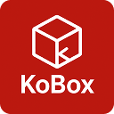

  

# KoBox

> Chrome extension to find optimal checkout combinations from your Kobo wishlist

## ✨ Features

- **🔄 One-Click Import** - Quickly import books from your Kobo wishlist
- **🎯 Smart Calculation** - Automatically find optimal combinations that meet your target price
- **💰 Price Optimization** - Precisely calculate book combinations to reach minimum checkout threshold

## 🚀 Quick Start

### Installation

### How to Use

1. **Go to Kobo Wishlist**
   - Login to [Kobo website](https://www.kobo.com)
   - Navigate to your wishlist page

2. **Import Books Data**
   - Click the KoBox icon in the toolbar
   - Click "Import Books Data" button

3. **Set Target Price**
   - Enter your desired minimum checkout amount
   - Example: 1000 (means total price at least $1000)

4. **Find Best Combinations**
   - Click "Find Combinations" button
   - Browse the recommended book combination list

---

**Note**: This extension is for personal use only. Please comply with Kobo website terms of service. All data is processed locally and no personal information is collected.

