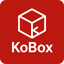

  

# KoBox

> Chrome extension to find optimal checkout combinations from your Kobo wishlist

## ✨ Features

- **🔄 One-Click Import** - Quickly import books from your Kobo wishlist
- **🎯 Smart Calculation** - Automatically find optimal combinations that meet your target price
- **💰 Price Optimization** - Precisely calculate book combinations to reach minimum checkout threshold
- **📌 Pin Books** - Pin specific books to ensure they always appear in combinations
- **✅ Batch Operations** - Select all, unselect all, or unpin all books with one click
- **🔗 Share List** - Copy a link (up to `MAX_SHARE_BOOKS` books, see `src/shared/config.js`) so others can view it and import selected titles
- **💾 JSON Backup** - Export or import the full book list as a JSON file

## 🚀 Quick Start

### Installation

- Visit [Chrome Web Store](https://chromewebstore.google.com/detail/kobox/ghlalaokkeodecoaelhjfmfcgknifkno?authuser=0&hl=zh-TW) to install the extension

### How to Use

1. **Go to Kobo Wishlist**
   - Login to [Kobo website](https://www.kobo.com)
   - Navigate to your wishlist page

2. **Import Books Data**
   - Click the KoBox icon in the toolbar
   - Click "Import Books Data" button

3. **Pin Must-Have Books (Optional)**
   - Click the 📌 icon next to any book to pin it
   - Pinned books will always be included in every combination

4. **Set Target Price**
   - Enter your desired minimum checkout amount
   - Example: 1000 (means total price at least $1000)

5. **Find Best Combinations**
   - Click "Find Combinations" button
   - Browse the recommended book combination list
   - Pinned books are highlighted for easy identification

6. **Share a List (Optional)**
   - Click "Share list" and copy the link (up to `MAX_SHARE_BOOKS` books)
   - Recipients open [kobox-extension.netlify.app](https://kobox-extension.netlify.app), tick books, and import them into KoBox
   - People without the extension are directed to the Chrome Web Store
   - Book data lives in the URL hash and is not stored on a server

7. **Export / Import JSON (Optional)**
   - Use **Export JSON** to back up the full list (no 10-book limit)
   - Use **Import JSON** on another browser or device; existing books are matched by `productId`

---

**Note**: This extension is for personal use only. Please comply with Kobo website terms of service. Wishlist data stays on your device. A share link encodes the selected books in the URL itself; nothing is uploaded to a KoBox server.

### Deploy the share page (Netlify)

1. Import this GitHub repository in [Netlify](https://www.netlify.com/)
2. The included `netlify.toml` already sets `npm run build:site` and the `dist-site` publish directory
3. Set the site name to `kobox-extension` so the public URL is `https://kobox-extension.netlify.app` (or update `src/shared/config.js` if you use another name)
4. After the first deploy, share links copied from the extension will open that site

